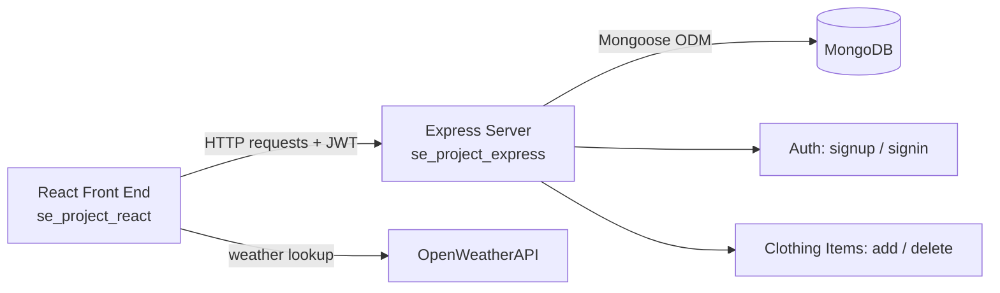

# WTWR (What to Wear?) — Back End

The API server for WTWR, managing user profiles and clothing items and serving weather-matched wardrobe data.

🔗 **Live Demo:** [cmwtwr.largent.org](https://cmwtwr.largent.org) &nbsp;|&nbsp; 🎥 **Demo Video:** project pitch: https://www.loom.com/share/e50887391d49445eb24a73aafec5cee6
Spint 15 Project Pitch: https://www.loom.com/share/28e6471ec8f2475d8ff7fe9462f12b02

**Companion repo:** [WTWR — Front End](https://github.com/cmarsee-blip/se_project_react)

---

## 📖 Overview

This is the backend for the WTWR application. The goal was to build a REST API that stores users' clothing items and profiles, and supports the front end's weather-based outfit recommendations.

## 🛠️ What I Built & How

I built a Node.js/Express server backed by MongoDB (via Mongoose) that exposes endpoints for managing clothing items — adding and deleting items tied to a user's wardrobe — and supports filtering that wardrobe data to match current weather conditions requested by the front end.

**Key features:**
- Add and delete clothing items via REST endpoints
- MongoDB/Mongoose data models for users and clothing items
- Filtering logic to match wardrobe items to weather conditions
- Deployed and running live

**Built with:** Express, Node.js, MongoDB, Mongoose

## 🏗️ Architecture



## ⚙️ Running It Locally

```bash
git clone https://github.com/cmarsee-blip/se_project_express.git
cd se_project_express
npm install
npm run start   # or: npm run dev (with hot reload)
```
Requires a running MongoDB instance and any relevant environment variables (DB connection string, JWT secret, etc.) configured before starting.

## ✅ Results

The API is live at [cmwtwr.largent.org](https://cmwtwr.largent.org) and successfully serves the companion React front end with user and clothing item data.

## 🚀 Future Improvements

- Fix [add a specific limitation you noticed] using [your planned approach] to achieve [the outcome].
- Fix [add a specific limitation you noticed] using [your planned approach] to achieve [the outcome].
